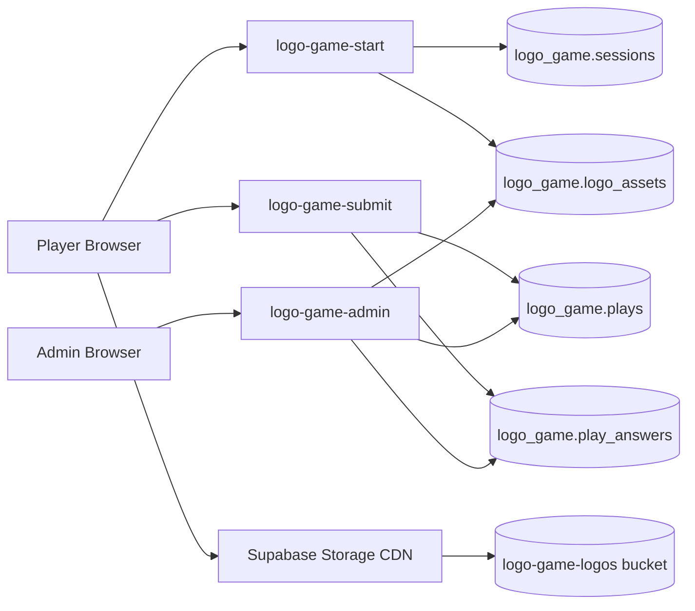

# Logo Game Consolidated Plan

Last updated: 2026-05-22

This document is the source of truth for what has been planned, what has shipped, and what remains for Logo Game. It now covers the original game improvements, leaderboard/profile/admin work, Travel & Adventure, Supabase logo storage, the next live verification pass, and the next expansion ideas.

## Execution Rules

- Do not push anything unless explicitly approved.
- Run tests before any commit.
- Keep the active app in `src/` as the source of truth.
- Keep Supabase work isolated inside the `logo_game` schema and Edge Functions.
- Keep anti-cheat logic server-side: questions and score validation must not depend on browser trust.
- Use British spelling and wording for any new user-facing copy.
- For live browser checks, use the Codex Chrome MCP tab group and test the deployed GitHub Pages URL: `https://ayohx.github.io/logo-game/`.

## Current Status Summary

- The original game improvement work is complete and pushed.
- The Supabase-backed anti-cheat shared leaderboard is complete and pushed.
- Editable player profiles, stable player IDs, avatars, share links, and persistent best-score behaviour are complete and pushed.
- The Travel & Adventure pack is complete and pushed with 100 logos, including Holiday Extras.
- `/admin.html` is live with passworded analytics, tabs, filters, sorting, pagination, overview cards, player/device stats, leaderboard, question insights, and Logo Health.
- Old root-level runtime files have been cleaned so `src/` remains the active app.
- Supabase Storage logo infrastructure is complete and pushed.
- Current logo assets are uploaded and verified in Supabase Storage:
  - 230/230 uploaded
  - 230/230 verified
  - 0 missing
- The live game now loads logos from Supabase Storage first, with logo.dev only as fallback.
- Latest full test suite: `111/111` passing after all-logo Mix Brands.
- Latest pushed commit before all-logo mode: `2fc3651 feat: enable Supabase logo storage`.
- Current next step: push all-logo Mix Brands, then build the Tech & Car pack.
- Next expansion packs selected for planning: Tech & Car, then Fashion & Finance.

## Remaining Work To Complete

1. Live play-test the deployed game.
   - Desktop and mobile.
   - Mix Brands, Travel & Adventure, Tech & Car, and Fashion & Finance.
   - Confirm logo loading speed, no blank-logo countdowns, result submission, leaderboard behaviour, and admin analytics updates.
2. Upgrade the admin experience.
   - Improve visual hierarchy, charts, Logo Health, Question Insights, player analytics, date filtering, and CSV export.
3. Keep later expansion ideas parked until the core roadmap above is complete.
   - Food, Drink & Restaurants.
   - Sport, Media & Entertainment.
   - Weekly/monthly leaderboard.
   - Logo review workflow.
   - Difficulty tuning and logo archive/disable support.

## Done And Pushed

### Original Improvement Plan

- [x] Keep the active app in `src/` as the runtime source of truth.
  - Live app loads `src/main.js` from `index.html`.
- [x] Improve brand question generation and distractors.
  - Commit: `0c81a3d feat: improve brand question distractors`
- [x] Improve answer feedback and results UX.
  - Commit: `48605d6 feat: improve results feedback`
- [x] Add audio and accessibility polish.
  - Commit: `2a25a82 feat: polish audio and accessibility`
- [x] Add pause/session/debug support.
- [x] Run source tests before commits.
- [x] Clean up legacy root-level clutter.
  - Legacy root runtime files were removed because they duplicated the active `src/` module system.

### Shared Leaderboard And Anti-Cheat

- [x] Add Supabase-backed shared leaderboard.
  - Commit: `4ad57f3 feat: add Supabase shared leaderboard`
  - Server issues questions and validates submitted answers.
- [x] Retain one best score per player name/player identity.
  - Lower later scores do not replace retained best.
- [x] Keep score submission server-side through Edge Functions.
  - Browser submits answer log; server validates against stored session questions.

### Editable Profiles And Sharing

- [x] Add editable no-password player profiles.
  - Commit: `7993387 feat: add editable leaderboard profiles`
- [x] Add leaderboard avatars, emoji initials, and profile editing.
- [x] Add share result flow with player-specific leaderboard link.
- [x] Improve profile start flow.
  - Commit: `dc97706 fix: improve profile start flow`
- [x] Polish emoji avatar picker.
  - Commit: `31b3ae6 fix: polish emoji avatar picker`
- [x] Sync avatar preview with typed profile name.
  - Commit: `e464193 fix: sync avatar preview with profile name`
- [x] Keep saved profile ID aligned with local player ID.
  - Commit: `172488a fix: keep saved profile id aligned`
- [x] Refresh cached profile script after API changes.
  - Commit: `60ccda6 fix: refresh profile script cache`

### Admin Analytics

- [x] Add simple passworded admin analytics page.
  - Commit: `2f514a9 feat: add passworded admin analytics`
- [x] Add admin password setting in database.
- [x] Add per-play analytics table.
- [x] Show overview cards, player summary, recent plays, and leaderboard snapshot.
- [x] Add advanced admin analytics.
  - Commit: `ce77f37 feat: expand admin analytics and stabilise logos`
  - Added tabs, filters, sorting, pagination, richer overview cards, player/device stats, leaderboard, question insights, and Logo Health.
- [x] Add per-question analytics writes through `logo_game.play_answers`.
- [x] Keep RLS enabled and restrict admin access through Edge Functions.

### Travel & Adventure Pack

- [x] Add Travel & Adventure pack with 100 logos.
  - Commit: `9ad0d22 feat: add travel pack with logo credit savings`
- [x] Include Holiday Extras in the Travel & Adventure pack.
- [x] Add pack selection UI.
- [x] Update Supabase `logo-game-start` to serve Travel questions securely.
- [x] Reduce logo.dev credit waste by removing random image cycling from the shuffle animation.
- [x] Reduce homepage logo parade from 10 to 6 selected-pack logos.
- [x] Cache-bust frontend entry point after Travel pack changes.

### Supabase Logo Storage

- [x] Create public Supabase Storage bucket: `logo-game-logos`.
- [x] Add `logo_game.logo_assets` registry.
- [x] Add `scripts/sync-logo-assets.mjs`.
- [x] Add secure `logo-game-logo-assets` Edge Function for registry writes.
- [x] Upload and verify all current logo assets.
  - 230/230 uploaded.
  - 230/230 verified.
  - 0 missing.
- [x] Switch runtime logo loading to Supabase Storage first.
  - Commit: `2fc3651 feat: enable Supabase logo storage`
- [x] Keep logo.dev as fallback only.
- [x] Add readable brand-name fallback if both stored logo and logo.dev fail.
- [x] Add Logo Health admin tab backed by `logo_game.logo_assets`.
- [x] Verify Supabase Storage spot checks return `200 image/png`.

## Active Workstream: Live Play-Testing And Admin Verification

Goal: verify that the deployed game feels reliable now that logos are served from Supabase Storage, and confirm admin analytics update correctly from real plays.

### Desktop

- [ ] Open the live GitHub Pages URL in the Codex Chrome MCP tab group.
- [ ] Play Mix Brands from start to result.
- [ ] Confirm prompt logos and option logos load quickly.
- [ ] Confirm countdown does not start while a required prompt logo is blank.
- [ ] Confirm failed logo fallback behaviour is acceptable if any image fails.
- [ ] Submit/record result and confirm public leaderboard behaviour.
- [ ] Repeat for Travel & Adventure.

### Mobile

- [ ] Test mobile viewport or real mobile-sized browser.
- [ ] Play Mix Brands from start to result.
- [ ] Play Travel & Adventure from start to result.
- [ ] Confirm options, profile/avatar controls, countdown, result screen, share link, and leaderboard are usable without wrapping/overlap.

### Admin

- [ ] Open `/admin.html` after live plays.
- [ ] Confirm overview totals update.
- [ ] Confirm Recent Plays includes the new games.
- [ ] Confirm Players & Devices updates the current player/device.
- [ ] Confirm Leaderboard reflects retained best-score rules.
- [ ] Confirm Question Insights gains new answer rows.
- [ ] Confirm Logo Health remains 356 verified / 0 missing.

## Completed Workstream: General Mode Uses All Logos

Goal: make the default General/Mix Brands mode use the full verified logo catalogue, not just the original General pool, while category-specific modes remain curated.

### Product Decision

- [x] Treat General as "all available logos".
  - Include every verified logo from every enabled pack unless a logo is explicitly disabled.
  - Keep dedicated packs such as Travel & Adventure as filtered experiences.
- [x] Decide whether the label should stay "Mix Brands" or become "All Logos".
  - Decision: keep "Mix Brands" for now to avoid changing the UI label while expanding the pool.
- [x] Decide whether General should include future specialist packs automatically.
  - Recommended: yes, but only after each pack passes the 100-logo verification gate and is enabled.

### Data Model

- [x] Add a catalogue-level pool builder that deduplicates by domain across all enabled packs.
- [x] Keep each logo's pack membership and category metadata.
- [x] Make question generation accept:
  - `all` / `general`: deduped enabled catalogue.
  - pack IDs such as `travel`: specific curated pool.
- [x] Ensure server-issued questions use the same pool rules as the browser.
- [x] Confirm Supabase `logo_assets` metadata supports pack filtering through the `packs` array.

### Gameplay

- [x] Keep pack selector copy and route/state handling stable.
- [x] Make General distractors pull from the all-logo catalogue.
- [x] Ensure duplicate domains appear only once per General pool.
- [x] Preserve category-balanced correct-answer selection where possible.
- [x] Add tests proving General includes both original brand logos and Travel logos.

### Storage

- [x] Ensure new General mode only uses verified Supabase Storage assets.
- [x] Keep logo.dev fallback for runtime resilience, not normal loading.
- [ ] Update sync script so future packs are included without manually editing multiple import lists.

## Completed Workstream: New 100+ Logo Category Packs

Goal: add more category packs only when each pack can provide at least 100 recognisable, verified logos.

### Logo.dev Discovery Notes

- [x] Validate against Logo.dev before implementation.
  - The public Logo.dev category directory does not currently show a single category with 100+ brands.
  - The largest visible public categories are below the 100-logo target, so new packs should be curated composites rather than direct one-category imports.
- [x] Use the 100-logo gate for every new pack.
  - At least 100 candidate domains.
  - At least 100 verified Supabase Storage uploads.
  - 0 missing required logos before enabling the pack.
  - Recognisable enough for normal players, not just technically available.

### Candidate Pack Backlog

- [x] Tech & Car
  - Priority pack 1.
  - Composite scope: major tech companies, SaaS/productivity, AI, cybersecurity, social platforms, streaming, gaming, telecoms, electronics, car manufacturers, EV brands, mobility, and automotive services.
  - Rationale: the current General pool already contains a strong base of tech and automotive logos, and Logo.dev has enough related public categories to support a 100-logo curated composite if the candidate list is reviewed properly.
  - Acceptance gate: at least 100 recognisable verified logos, with duplicate parent/sub-brand conflicts removed.
- [x] Fashion & Finance
  - Priority pack 2.
  - Composite scope: fashion, luxury, sportswear, beauty, retail lifestyle brands, banks, payment networks, fintech, investing, accounting, insurance, and trading brands.
  - Rationale: combining the two categories should make the 100-logo threshold more realistic while keeping the pack broad enough for normal players.
  - Acceptance gate: at least 100 recognisable verified logos, with UK/global balance and no weak financial or fashion sub-brands that players are unlikely to know.
- [ ] Food, Drink & Restaurants
  - Later candidate.
  - Possible but not guaranteed from Logo.dev public categories alone.
  - Would need global restaurants, fast food, beverages, snacks, supermarkets, delivery apps, and food manufacturers.
- [ ] Sport, Media & Entertainment
  - Later candidate.
  - Possible, but requires a recognisability review because team, league, college, streaming, gaming, and media logos vary heavily by region.

### Pack Creation Process

- [x] Create the Tech & Car candidate domain list first.
- [x] Create the Fashion & Finance candidate domain list second.
- [x] Build and release one pack at a time.
- [x] Run logo.dev/Supabase sync in dry-run mode first.
- [x] Reject weak candidates before upload:
  - missing logo,
  - generic placeholder,
  - low recognisability,
  - duplicate parent/sub-brand confusion,
  - ambiguous logo/name pair.
- [x] Upload verified assets to Supabase Storage.
- [x] Upsert `logo_game.logo_assets`.
- [x] Add source data files under `src/data/`.
- [x] Register packs in shared pack config.
- [x] Update server Edge Function pack allowlist.
- [x] Add tests for pack size, duplicate domains, question generation, storage support, and UI selector visibility.
- [x] Smoke-test live start-game API before push.

## Completed Workstream: Required Category Selection And Gameplay Reminder

Goal: make category choice deliberate now that the game has multiple packs, and keep the selected category visible during play.

- [x] Disable Start Game until the player chooses a category.
- [x] Remove the default selected category from the start screen.
- [x] Show the selected category as a compact prominent badge in the gameplay HUD.
- [x] Keep the reminder responsive for small mobile screens.
- [x] Add tests for the disabled start state and gameplay HUD category badge.

## Planned Workstream: Admin Experience Upgrade

Goal: decide whether `/admin.html` is only "functional" or should become a sharper operations dashboard for managing growth.

### Current Assessment

- [ ] Treat the current admin page as V2 functional analytics, not the final best possible interface.
  - It has the right datasets and controls.
  - The visual hierarchy is still basic: metric cards, filter controls, tabs, and tables are serviceable but not yet a polished analytics product.

### Visual/UX Improvements

- [ ] Add stronger dashboard hierarchy:
  - primary KPI row,
  - trend/change indicators,
  - compact secondary metrics,
  - clearer "what needs attention" area.
- [ ] Add useful charts where they answer real questions:
  - plays over time,
  - completion rate over time,
  - average score by pack,
  - category popularity vs performance,
  - wrong-rate distribution,
  - slowest/most failed logos.
- [ ] Improve Logo Health into an operational review tool:
  - logo thumbnails,
  - status chips,
  - pack/category filters,
  - missing/needs-review priority,
  - last verified date,
  - quick visual scan for broken or poor logos.
- [ ] Improve Question Insights:
  - thumbnail/logo preview,
  - attempts threshold,
  - difficulty score,
  - most confused-with pair,
  - "needs distractor review" flag.
- [ ] Improve player analytics:
  - returning vs new players,
  - best score trend,
  - average session duration,
  - each player's strongest category,
  - device/player identity clarity.
- [x] Add category performance metrics across admin:
  - overview cards for most played category and best-performing category,
  - category table showing plays, completion rate, average score, average correct count, average answer speed, and timeout/wrong-rate,
  - player/leaderboard table column for strongest category,
  - clear labels so "most played" does not get confused with "best performing".
- [x] Add date filtering once enough play data exists.
  - Add Today, Last 7 days, Last 30 days, and All time controls.
  - Apply the range to overview, recent plays, category performance, player stats, leaderboard where relevant, question insights, and logo-health verification dates.
  - Keep date filtering visibly separate from pack and search filters.
- [ ] Add CSV export for admin tables.

### Technical Improvements

- [ ] Move pack metadata into one shared config so game UI, admin UI, tests, sync script, and Edge Functions do not drift.
- [ ] Add admin response shape tests where possible.
- [ ] Add client-side rendering tests for admin tabs if the app gains a browser-test harness.
- [ ] Consider a simple charting dependency only if it keeps the admin page maintainable.

## Future Expansion Ideas

- [ ] Add weekly/monthly leaderboard once there is enough repeat play.
- [ ] Add streaks or badges if they do not compromise the simple quiz flow.
- [ ] Add a logo review workflow in admin.
- [ ] Add category difficulty tuning once question analytics has enough data.
- [ ] Add archive/disable flag for low-quality logos without deleting historical analytics.

## Data Flow Target

## Regroup Checkpoint

Before implementation resumes:

1. Live-test Mix Brands and Travel & Adventure on desktop and mobile.
2. Confirm whether General should be renamed to All Logos.
3. Curate Tech & Car as the first new 100+ logo pack.
4. Decide whether admin V3 should be a visual polish pass, a charting/data pass, or both.
5. Confirm no push until explicit approval.
