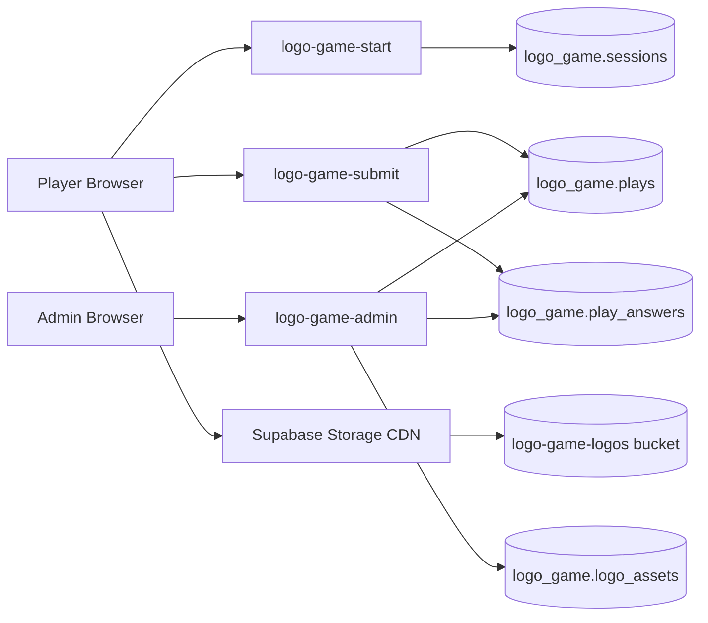

# Logo Game Consolidated Plan

Last updated: 2026-05-21

This document merges the original improvement plan, the leaderboard/profile/admin work that was added during implementation, and the new admin analytics plus Supabase logo-storage plan. It is the single planning tracker before we resume implementation.

## Execution Rules

- Do not push anything unless explicitly approved.
- Run tests before any commit.
- Keep the active app in `src/` as the source of truth.
- Keep Supabase work isolated inside the `logo_game` schema and Edge Functions.
- Keep anti-cheat logic server-side: questions and score validation must not depend on browser trust.
- Use British spelling and wording for any new user-facing copy.

## Current Status Summary

- The original game improvement work is mostly complete and pushed.
- The shared leaderboard, editable profiles, admin page, and Travel & Adventure pack are complete and pushed.
- There are local fixes for logo loading reliability and mobile avatar layout that are tested but not committed or pushed.
- The admin analytics redesign is now implemented and deployed to Supabase, with frontend changes ready to push.
- The Supabase Storage bucket, registry table, and local sync script are now in place.
- Logo Storage runtime support is code-ready but intentionally disabled until the logo upload is completed with a Supabase service-role key.

## Done And Pushed

### Original Improvement Plan

- [x] Keep the active app in `src/` as the runtime source of truth.
  - Live app loads `src/main.js` from `index.html`.
- [x] Improve brand question generation and distractors.
  - Commit: `0c81a3d feat: improve brand question distractors`
- [x] Improve answer feedback and results UX.
  - Commit: `48605d6 feat: improve results feedback`
- [x] Add audio and accessibility polish.
  - Commit: `2a25a82 feat: polish audio and accessibility`
- [x] Run source tests before commits.
  - Continued across implementation phases.
- [x] Clean up legacy root-level clutter only if it affects clarity.
  - Legacy root runtime files were removed because they duplicated the active `src/` module system.

### Shared Leaderboard And Anti-Cheat

- [x] Add Supabase-backed shared leaderboard.
  - Commit: `4ad57f3 feat: add Supabase shared leaderboard`
  - Server issues questions and validates submitted answers.
- [x] Retain one best score per player name.
  - Lower later scores do not replace retained best.
- [x] Keep score submission server-side through Edge Functions.
  - Browser submits answer log; server validates against stored session questions.

### Editable Profiles And Sharing

- [x] Add editable no-password player profiles.
  - Commit: `7993387 feat: add editable leaderboard profiles`
- [x] Add leaderboard avatars.
- [x] Add share result flow with player-specific leaderboard link.
- [x] Improve profile start flow.
  - Commit: `dc97706 fix: improve profile start flow`
- [x] Polish emoji avatar picker.
  - Commit: `31b3ae6 fix: polish emoji avatar picker`
- [x] Sync avatar preview with typed profile name.
  - Commit: `e464193 fix: sync avatar preview with profile name`
- [x] Keep saved profile ID aligned with local player ID.
  - Commit: `172488a fix: keep saved profile id aligned`
- [x] Refresh cached profile script after API changes.
  - Commit: `60ccda6 fix: refresh profile script cache`

### Admin Analytics V1

- [x] Add simple passworded admin analytics page.
  - Commit: `2f514a9 feat: add passworded admin analytics`
- [x] Add admin password setting in database.
- [x] Add per-play analytics table.
- [x] Show current overview cards, player summary, recent plays, and leaderboard snapshot.
- [ ] Add advanced tabs, filtering, sorting, pagination, and question-level analytics.
  - Planned in the next workstream.

### Travel & Adventure Pack And Logo Credit Savings

- [x] Add Travel & Adventure pack with 100 logos.
  - Commit: `9ad0d22 feat: add travel pack with logo credit savings`
- [x] Include Holiday Extras in the Travel & Adventure pack.
- [x] Add pack selection UI.
- [x] Update Supabase `logo-game-start` to serve Travel questions securely.
- [x] Reduce logo.dev credit waste by removing random image cycling from the shuffle animation.
- [x] Reduce homepage logo parade from 10 to 6 selected-pack logos.
- [x] Cache-bust frontend entry point after Travel pack changes.

## Done Locally Or Deployed But Not Pushed

These changes are present in the working tree and were tested locally, but they are not committed or pushed.

- [x] Wait for required question logo assets before starting the countdown.
  - Files: `src/game/engine.js`, `test/accessibility-audio.test.mjs`
  - Purpose: prevent players seeing a blank logo while the timer is already running.
- [x] Show readable brand-name fallback if a prompt or option logo fails to load.
  - Files: `src/game/engine.js`, `style.css`
- [x] Make mobile avatar emoji choices smaller and non-wrapping.
  - Files: `style.css`, `test/profile-sharing.test.mjs`
  - Purpose: keep the final star emoji on the same row on mobile.
- [x] Cache-bust `style.css` and `src/main.js` for the local logo loading fix.
  - File: `index.html`
- [x] Full local test suite passed after these changes.
  - `node --test test/*.test.mjs`
  - Result: `104/104` passing after admin work.
- [x] Admin analytics schema was deployed to Supabase.
  - Added `logo_game.play_answers`.
  - Added summary columns on `logo_game.plays`.
- [x] `logo-game-submit` was deployed with per-question analytics writes.
- [x] `logo-game-admin` was deployed with tab-specific, filtered, sorted, paged analytics responses.
- [x] Admin frontend was redesigned locally with tabs, filters, page size, sorting, pagination, and richer overview cards.

## Completed Workstream: Admin Analytics Redesign

Goal: make `/admin.html` useful as the game grows, without dumping everything into one large page.

### Database

- [x] Add `logo_game.play_answers` table.
  - One row per question answered.
  - Stores player/device identity, pack, question number, mode, correct logo, chosen logo, correctness, timeout status, answer time, points earned, and timestamp.
- [x] Add extra summary columns to `logo_game.plays` only where useful.
  - Candidate columns: `pack`, `timeout_count`, `wrong_count`, `slowest_time`, `completed_questions`.
- [x] Keep RLS enabled and restrict access through Edge Functions.

### Edge Functions

- [x] Update `logo-game-submit`.
  - Continue writing one completed-game summary row.
  - Also write ten per-question `play_answers` rows per completed session.
- [x] Update `logo-game-admin`.
  - Return tab-specific datasets instead of one large response.
  - Support pagination, sorting, filters, and search.

### Admin UI

- [x] Redesign `admin.html` into tabs:
  - Overview
  - Recent Plays
  - Players and Devices
  - Leaderboard
  - Question Insights
  - Logo Health, after storage migration remains future work
- [x] Add overview cards:
  - Games started
  - Completed games
  - Completion rate
  - Unique players/devices
  - Average score
  - Average correct answers
  - Average answer speed
  - Fastest average player
  - Most played pack
  - Total timeouts
- [x] Add table controls:
  - Page size: 10, 20, 50, 100
  - Sortable headers
  - Pack filter
  - Player/device search
  - Refresh
- [x] Add question insights:
  - Hardest logos by wrong rate
  - Most timed-out logos
  - Fastest answered logos
  - Slowest answered logos
  - Most common wrong choices

## Active Workstream: Supabase Logo Storage

Goal: stop relying on live logo.dev requests during gameplay and serve verified assets from Supabase Storage.

### Storage

- [x] Create public Supabase Storage bucket.
  - Proposed bucket: `logo-game-logos`
- [x] Store versioned assets.
  - Example paths:
    - `v1/apple.com.png`
    - `v1/holidayextras.com.png`
    - `v1/britishairways.com.png`
- [x] Use public CDN URLs for gameplay.
  - Supabase docs confirm public Storage buckets are CDN-backed and should have high cache-hit rates after first load.

### Metadata

- [x] Add `logo_game.logo_assets` table.
  - Fields: domain, name, pack, category, storage path, public URL, source URL, status, content type, content hash, verified date, updated date.
- [x] Track status:
  - `verified`
  - `missing`
  - `needs_review`

### Migration Script

- [x] Add local script to sync logos.
  - Proposed path: `scripts/sync-logo-assets.mjs`
- [x] Read `src/data/brands.js` and `src/data/travel.js`.
- [x] Deduplicate all current General and Travel domains.
- [x] Download each logo from logo.dev once.
- [x] Validate image responses.
- [x] Save a review manifest.
- [x] Upload verified files to Supabase Storage.
  - 230/230 assets uploaded and verified.
- [x] Upsert `logo_game.logo_assets`.
  - 230/230 registry rows written.
- [x] Use environment variables only for credentials.

### Runtime

- [x] Add Supabase Storage URL helpers in `src/ui/screens.js`.
- [x] Enable `logoStorageEnabled` after upload verification.
- [x] Keep readable fallback if a stored logo fails.
- [x] Add Logo Health tab to admin.
  - It reads `logo_game.logo_assets` and will populate after the upload script runs with `SUPABASE_SERVICE_ROLE_KEY`.

## Future Expansion Ideas

- [ ] Add more curated packs once logo storage and admin maintenance are stable.
- [ ] Add logo review workflow in admin.
- [ ] Add exportable CSV reports for admin tables.
- [ ] Add date filters once enough play data exists.
- [ ] Consider a weekly/monthly leaderboard later.

## Data Flow Target

## Regroup Checkpoint

Before implementation resumes:

1. Confirm whether to commit the current local logo/timer/avatar fixes first.
2. Confirm admin analytics redesign details.
3. Confirm no push until explicit approval.
4. Execute work in small phases with tests and smoke checks at each checkpoint.
